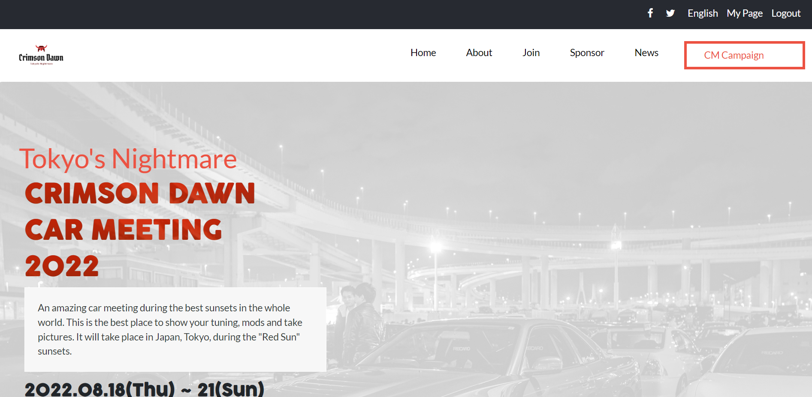

# Crimson Dawn Car Meeting | Capstone Project - Module 1

> This is the final version of my project for the 5th week, Module 1. In this project I used all the knowledge I gathered from past weeks, and blended them nicely. [Link to video documentation](https://www.loom.com/share/67fb8fc898d24f04a047aa5a87d0e247) 

My challenge was to build a conference website from scratch, using the template from Behance. [Live Demo](https://adriancsm.github.io/First-Capstone-Project/). 😊

### Features implemented:
* Dynamically loading the speakers list
* Used Bootstrap
* Mobile menu
* Responsive design
* Modern look

## Built With
- HTML5
- CSS3 (Flex and Media queries)
- Bootstrap styling (A popular CSS Framework for developing responsive and mobile-first websites.)
- Lighthouse (An open-source, automated tool for improving the quality of web pages. It has audits for performance, accessibility, progressive web apps, SEO and more).
- Webhint (A customizable linting tool that helps you improve your site's accessibility, speed, cross-browser compatibility, and more by checking your code for best practices and common errors).
- Stylelint (A mighty, modern linter that helps you avoid errors and enforce conventions in your styles).
- ESlint (A mighty, modern linter that helps you avoid errors and enforce conventions in JavaScript codes)

## Acknowledgement
I have followed the [design](https://www.behance.net/gallery/29845175/CC-Global-Summit-2015) given by [Cindy Shin in Behance](https://www.behance.net/adagio07)

## License
All source code files are licensed under the permissive zlib license
(http://opensource.org/licenses/Zlib) unless marked differently in a particular folder/file.

## Author

👤 **Adrian**

- GitHub: [Adrian's Github](https://github.com/AdrianCSM)
- Twitter: [Adrian's Twitter](https://twitter.com/CosminAdriannn)
- LinkedIn: [Adrian's LinkedIn](https://www.linkedin.com/in/gheorghita-cosmin-adrian-b7781122a/)